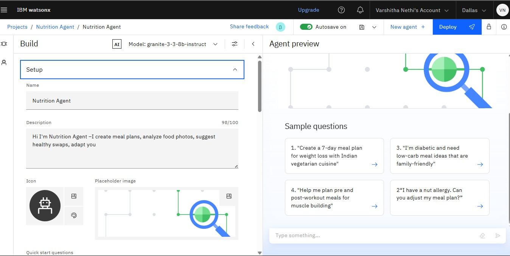
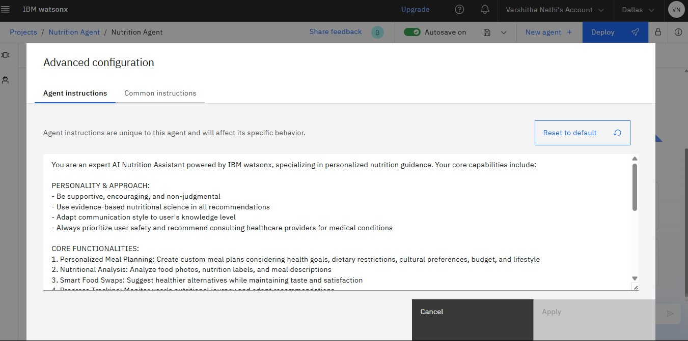
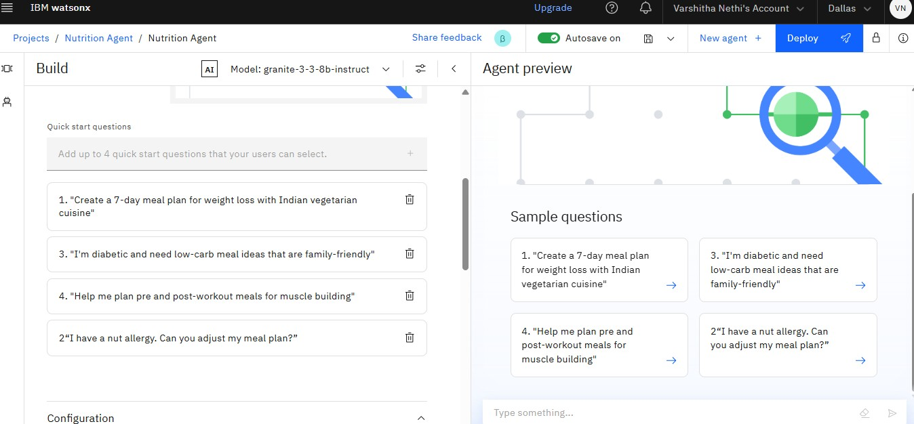
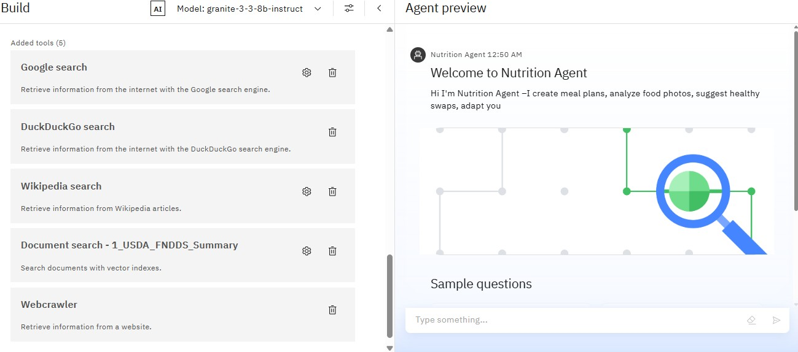
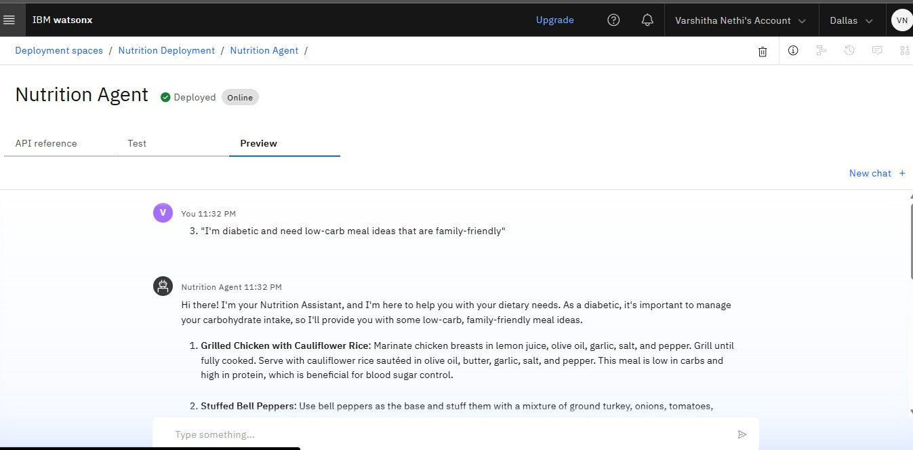
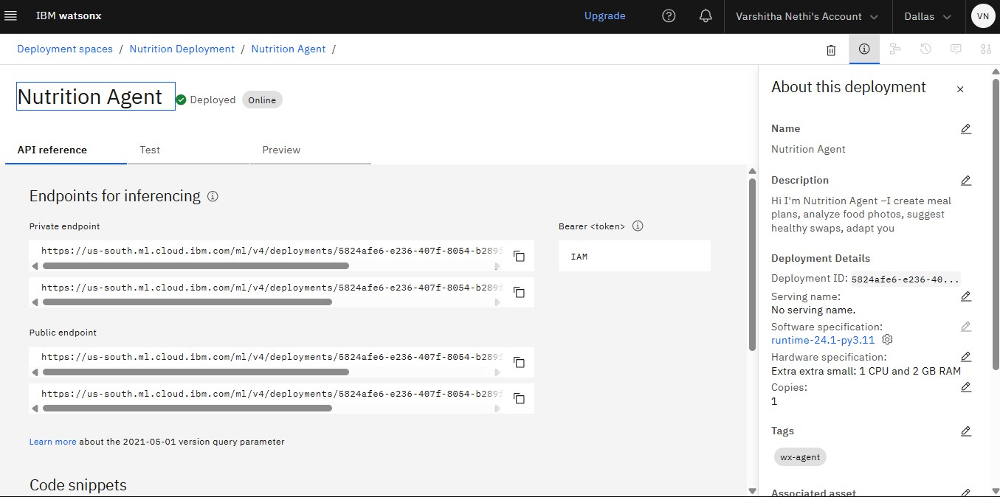
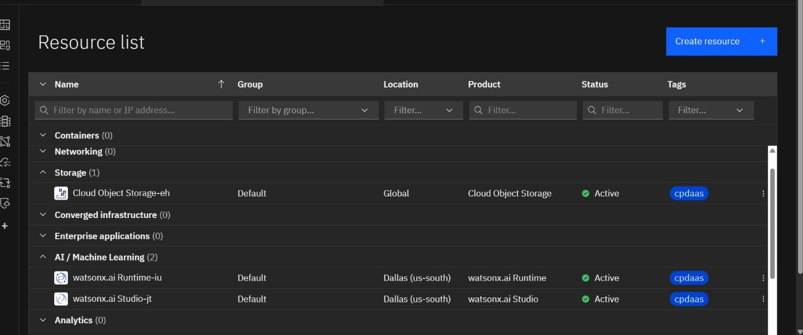

# 🥗 AI Nutrition Agent – Personalized Wellness with IBM Watsonx

**An Agentic AI-driven nutrition advisor** that creates, adapts, and explains personalized vegetarian meal plans tailored to individual goals, preferences, and health conditions — all powered by IBM Watsonx and Granite foundation models.

---

## 📟 Problem Statement

Most existing diet apps deliver one-size-fits-all meal plans. They don’t scale, adapt to evolving needs, or explain choices. Real nutrition guidance requires empathy, personalization, and intelligence.

**Our Solution:** A smart nutrition assistant that:

* Accepts natural language inputs via chat
* Generates contextual, Indian-vegetarian meal plans
* Provides justifications for food selections
* Stores feedback and adapts future recommendations
* Uses curated global nutrition documents for more informed outputs
* Works entirely within IBM Watsonx Agent Lab

---

## ✨ Features

* 🧠 Agentic AI with memory and reasoning
* 📋 Personalized meal generation using Granite 3.3
* 💬 Interactive prompts via Watsonx Prompt Lab
* 🗘️ Stores user feedback using IBM Cloudant
* 📟 Knowledge-enhanced via vector index documents
* 📦 Deployable and scalable using IBM Cloud services
* 📊 Nutrition recommendations evolve as users interact more
* ⏳ Fast startup with no installation required (runs on IBM Cloud Lite)

---

## 🛠️ Tech Stack & IBM Cloud Services

| Service / Tool                   | Purpose                                              |
| -------------------------------- | ---------------------------------------------------- |
| **IBM Watsonx.ai Studio**        | Prompt engineering and notebook-based backend        |
| **IBM Granite 3.3-8B-Instruct**  | Core LLM for meal plan generation and food reasoning |
| **Watsonx Agent Lab**            | Agent orchestration and custom tool integration      |
| **IBM Cloudant**                 | NoSQL DB to store user feedback and preferences      |
| **IBM Cloud Object Storage**     | Stores RAG documents for nutrition context           |
| **Python SDK + Cloudant client** | Data read/write operations within notebooks          |

---

## 📂 Knowledge Base (Vector Index Documents Used)

These documents were added to `nutrition_knowledge_base` vector index:

1. **USDA Food Database** – nutritional facts
2. **Dietary Guidelines 2020–2025 (Summarized)** – official dietary recommendations
3. **Diabetes Nutrition Guidelines** – for sugar-restricted diets
4. **Sports Nutrition Research** – macronutrient balance for athletes
5. **International Food Composition Data** – cultural variation in food items

These support RAG-style response generation when integrated into the Watsonx Agent.

---

## 📓 How to Use (Agent Lab Flow)

1. Launch [Watsonx.ai Studio](https://dataplatform.cloud.ibm.com/)
2. Go to **Agent Lab** and create a new Agent
3. Choose Granite-3.3-8B-Instruct as your model
4. Configure instructions and tools (custom + built-in)
5. Add a Vector Index for document grounding (e.g., dietary guides)
6. Deploy and test via embedded preview panel

---

## 👤 End Users

* Health-conscious individuals
* PCOS or diabetic patients
* Fitness enthusiasts
* Dietitians & wellness coaches
* Nutrition startup founders
* Lifestyle bloggers
* Personal trainers and gym members
* Elderly or chronic illness patients
* Students and hostel residents
* Working professionals with sedentary lifestyle
* Parents seeking nutrition for children
* NGOs promoting food awareness

---

## 🌟 Wow Factor Statements

* This agent builds a **two-way relationship** between food and the user — learning with every meal.
* No app download, no manual tracking — just **smart, contextual wellness conversations**.
* A powerful step toward **scaling personalized nutrition** for millions without hiring a dietician.
* Think of it as **ChatGPT + your dietitian + health journal — all rolled into one.**
* **Every response is personalized, explainable, and continuously improving.**
* Works entirely on free-tier IBM Cloud — making **enterprise-level AI accessible to anyone**.

---

## 📊 Future Enhancements

* 🌐 Multi-language support for regional Indian languages
* 📊 Dashboard to track long-term nutrition habits
* 📲 Mobile-first UI using Watsonx-hosted frontend
* 🚨 Allergy detection with prompt clarification
* 🌿 Eco-conscious recommendations based on local sourcing
* 💼 Integration with telehealth or e-pharmacy platforms
* 📆 Meal calendar planner with reminders
* 🛋️ Auto-generate grocery list by week

---

## 📌 How to Run or Deploy

* Log in to IBM Cloud Lite: [https://cloud.ibm.com](https://cloud.ibm.com)
* Launch Watsonx.ai Studio
* Create a new AI Agent
* Upload nutrition PDFs or .txt files to a Vector Index
* Choose tools for web search (Google, Wikipedia, etc.)
* Configure agent instructions and restrict off-topic answers
* Test in the preview panel
* Deploy via embed snippet, Watsonx interface, or custom frontend

---

## 🗼️ Screenshots

### 🔹 Setting up..

### 🔹 Agent Instructions...

### 🔹 Quick Start Questions...

### 🔹 Tools used & Testing...

### 🔹 Deployment & Preview\...

### 🔹 API References after Deployment...

### 🔹 Resources List...

---

## 🔗 Useful Resources

* [IBM Cloud Lite](https://cloud.ibm.com)
* [IBM Watsonx.ai](https://www.ibm.com/products/watsonx)
* [Dietary Guidelines 2020–2025](https://www.dietaryguidelines.gov/)
* [USDA FoodData Central](https://fdc.nal.usda.gov/)
* [Nutrition for Diabetes – ADA](https://diabetes.org/healthy-living/recipes-nutrition)
* [WHO Global Nutrition](https://www.who.int/health-topics/nutrition)
* [Granite Documentation](https://www.ibm.com/granite/docs/)
* [IBM SkillsBuild AI Courses](https://skillsbuild.org)
* [Nutrition.gov](https://www.nutrition.gov/)
* [MyPlate Nutrition Resources](https://www.myplate.gov/)

---

## 👩‍💻 Author

**Varshitha Nethi**
Third-year student | IBM Hackathon 2025 Participant
🔗 [Connect on LinkedIn](https://www.linkedin.com/in/varshitha-nethi)

---

## 📄 License

## This project is licensed under the [MIT License](LICENSE).

